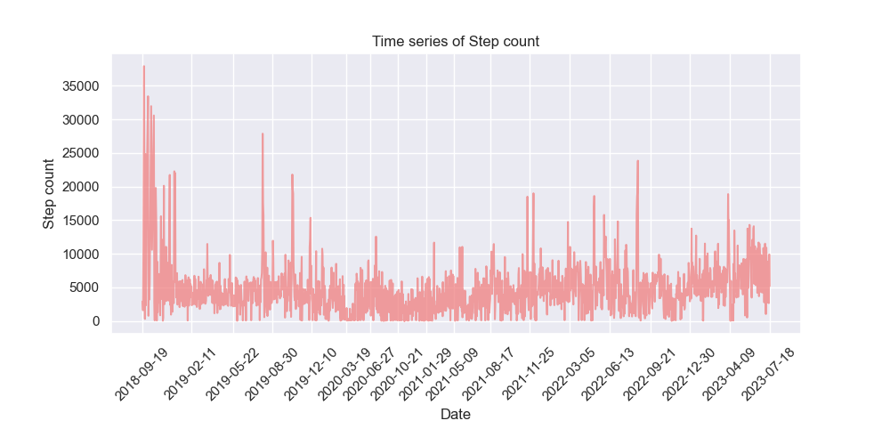
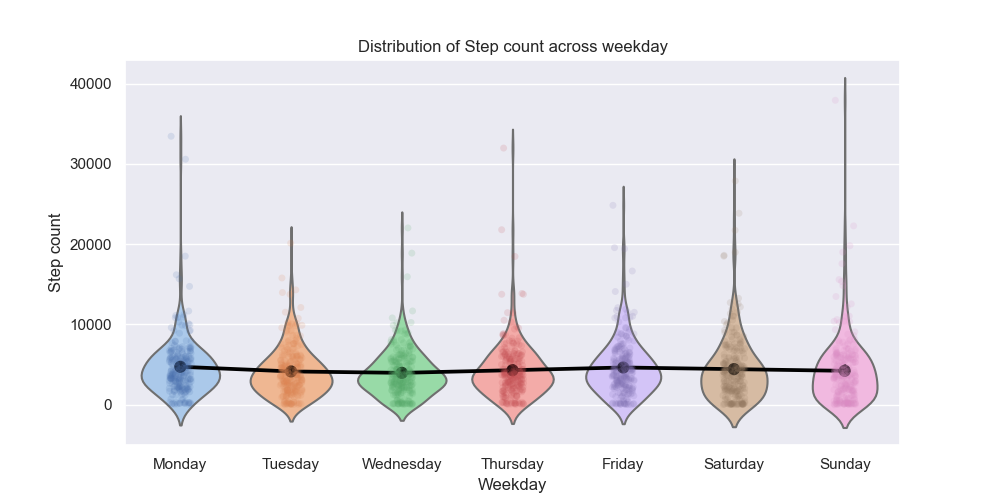
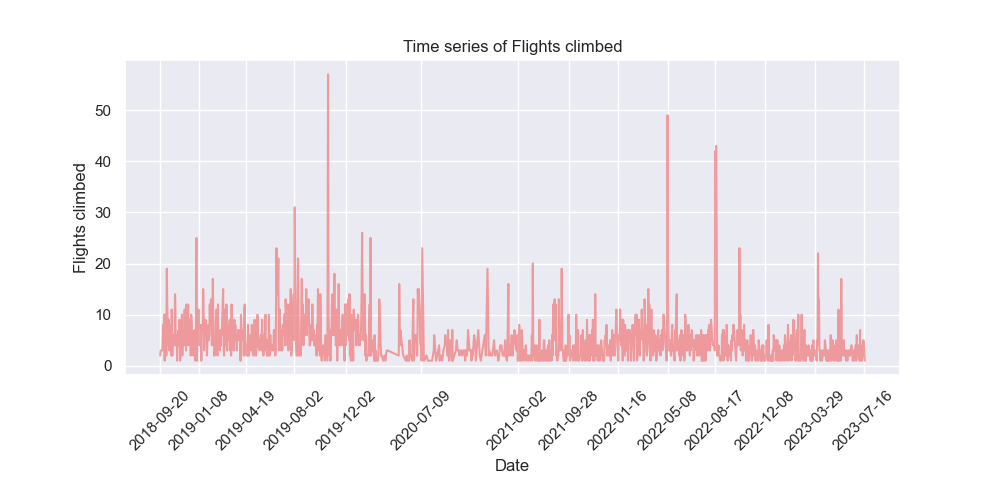
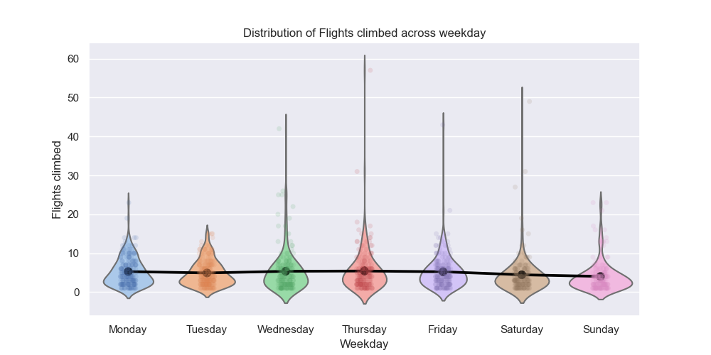
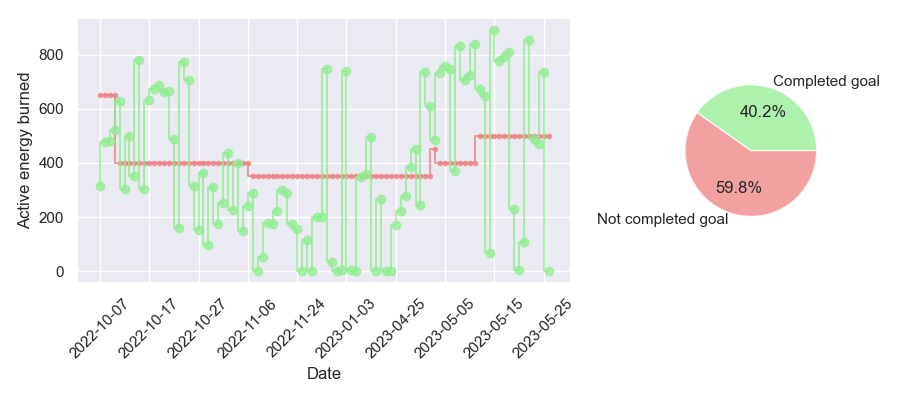

# Iphone health analytics
 Jupyter notebook to visualize and analyze the data from Iphone's Health app.

 # How does it work?
 First, the csv files exported from the Iphone's Health app are transformed into a Pandas dataframe, then:
 
 - main health metrics registered by the Iphone are visualized using matplotlib and seaborn. These include:
   - step count.
   - environmental audio levels.
   - number of flights climbed.
 - activity goals registed by the Apple Watch are displayed using seaborn and matplotlib. These include:
   - active calories burned.
   - minutes of exercise.
   - number of standing hours.

# Iphone metrics
Visualization of the main health metrics recorded by the Iphone.

## Steps
Daily time series

Week distribution

## Flights climbed
Daily time series

Week distribution

# Apple watch metrics
Visualization of the activity goals registered by the Apple Watch.

Performance vs goals  

